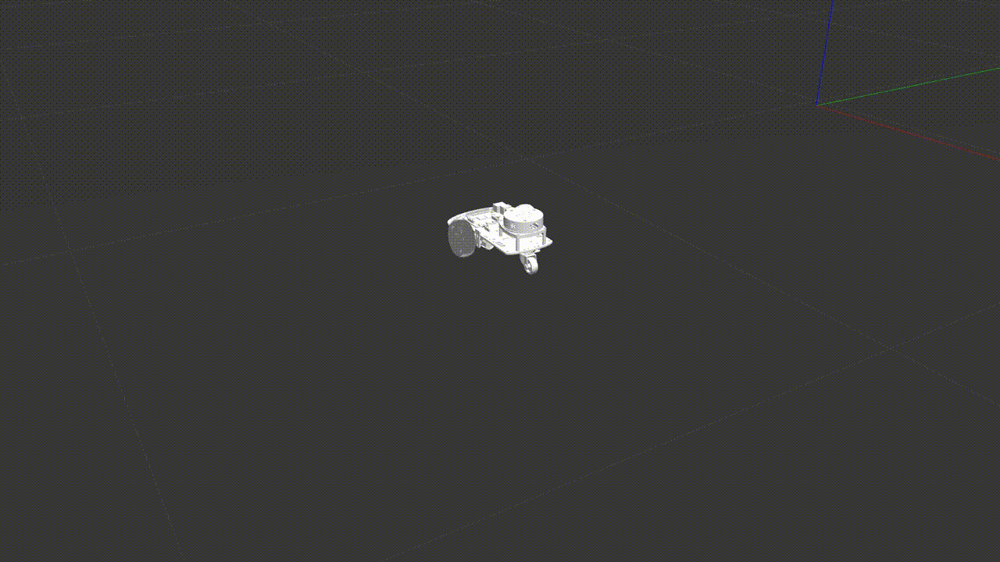

# Two Wheeled Lidar Robot Sim

    

---

Simulation of a 2 Wheeled Drive Lidar robot in Gazebo, visualized using Rviz2 and running ROS2 Foxy. 

To-do:
 - [ ] Joystick control
 - [ ] SLAM implementation

